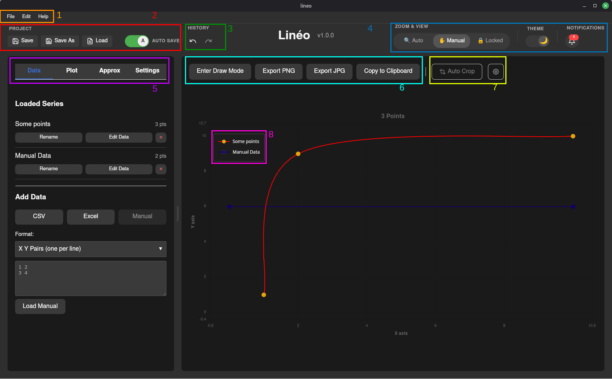

#  Linéo

> Create figures with beautiful approximation curves with few points.

[](https://www.rust-lang.org/)
[](https://tauri.app/)
[](https://opensource.org/licenses/MIT)
[](https://github.com/ThomasByr)

1. [Installation](#installation)
2. [Usage](#usage)
3. [Deploying Linéo as a Website](#deploying-linéo-as-a-website)
4. [TODO and Bugs](#todo-and-bugs)

## Installation

### Pre-built binaries

> [!NOTE]
> You can download the latest release of Linéo for your system from the [Releases](https://github.com/ThomasByr/Lineo/releases) page.

Please download the appropriate installer for your operating system, run the installer, and follow the installation instructions.

On MacOS, both Intel and Apple Silicon architectures are supported.

### Building from source

To build Linéo from source, make sure you have [Node.js](https://nodejs.org/) (with npm - [fnm](https://github.com/Schniz/fnm) is recommended), [Rust](https://www.rust-lang.org/tools/install) and [Tauri prerequisites](https://tauri.app/start/prerequisites/) installed.

<details><summary>All-in-one setup script (Debian-based Linux)</summary>

```bash
# tauri prerequisites
sudo apt update
sudo apt install libwebkit2gtk-4.1-dev \
  build-essential \
  curl \
  wget \
  file \
  libxdo-dev \
  libssl-dev \
  libayatana-appindicator3-dev \
  librsvg2-dev
# rustup
curl --proto '=https' --tlsv1.2 https://sh.rustup.rs -sSf | sh
source $HOME/.cargo/env
# nodejs + npm (using fnm)
cargo install fnm --locked
eval "$(fnm env)"
fnm install --lts
fnm use --lts
```

</details>

<details><summary>(Not so) all-in-one setup script (Windows - PowerShell)</summary>

```powershell
# Install rustup
Invoke-WebRequest -Uri https://win.rustup.rs/x86_64 -OutFile rustup-init.exe
Start-Process -FilePath .\rustup-init.exe -ArgumentList "-y" -NoNewWindow -Wait
Remove-Item .\rustup-init.exe
$env:Path += ";$env:USERPROFILE\.cargo\bin"
# Install fnm (Node.js version manager)
cargo install fnm --locked
$env:Path += ";$env:USERPROFILE\.cargo\bin"
fnm install --lts
fnm use --lts
```

</details>

Then, clone the repository and run the following commands in the project directory:

```bash
npm install
npm run tauri build
```

This will create the application binaries in the `src-tauri/target/release` directory. Installers are also generated in the `src-tauri/target/release/bundle` directory.

You can also run the application in development mode with:

```bash
npm run tauri dev
```

## Usage

Run the application and use the graphical interface to create and manipulate figures with approximation curves.



On the above image:

1. The top toolbar to access more settings and actions:
   - **File** menu: access to saving/opening projects, and undo/redo actions.
   - **Settings** menu: access to app zoom factor and theme.
   - **Help** menu: access to about section.
2. Save/Open project: save your current project to a file or open a previously saved project.
3. Undo/Redo your most recent actions.
4. App settings: change the zoom mode, switch from dark to light theme, and access recent action outcomes.
5. The tab selector allows you to switch between the different tools:
   - **Data**: for data creation and import. This allows to create and modify "series".
   - **Plot**: the settings for your different "series". Change the color, the point size and shape, etc.
   - **Approx**: this is where you can set your approximation curves. Choose the type of curve for each "series", and set the parameters.
   - **Settings**: settings for the canvas, like axes limits, grid lines, titles, etc.
6. Action buttons:
   - **Enter draw mode**: allows you to draw points directly on the canvas with the mouse and exporting them as a "serie".
   - **Export**: open the export modal to save the current canvas as a PNG or JPG image.
   - **Copy to clipboard**: copy the current canvas to the clipboard as an image.
7. Action settings:
   - **Auto Crop**: automatically crops exported images to tightly fit the content.
   - **Export Setting**: choose an upscaling factor for exported images.
8. The custom legend that is draggable and can be positioned anywhere on the canvas.

And of course the left menu changes depending on the selected tab to provide the relevant tools and settings. The main canvas area is where the figure is displayed and updated in real-time as you modify your data and settings.

## Deploying Linéo as a Website

Linéo has been updated to support running as a standard web application in addition to a desktop application.

To build the web version of Linéo, run:

```bash
npm run build
```

This will generate a `dist` directory containing the static website files.

### Hosting

You can host the contents of the `dist` directory on any static site hosting provider.

A GitHub Actions workflow has been included to automatically deploy to GitHub Pages.

1. Go to your repository **Settings** > **Pages**.
2. Under **Build and deployment**, select **GitHub Actions** as the source.
3. Push your changes to the `main` branch.
4. The `Deploy Web to GitHub Pages` workflow will run and deploy your site.

<details><summary>Troubleshooting: "Tag is not allowed to deploy"</summary>

If you see an error like `Tag "v0.1.1" is not allowed to deploy to github-pages due to environment protection rules`, you need to update your environment settings:

1. Go to repository **Settings** > **Environments** > **github-pages**.
2. Under **Deployment branches and tags**, click **Add deployment branch or tag rule**.
3. Select **Tag** from the dropdown.
4. Enter `v*` (or `*`) as the pattern.
5. Click **Add rule**.

</details>

### Limitations of Web Version

When running in the browser, some features behave differently compared to the desktop version:

- **Excel Import**: Currently disabled in the web version. Only CSV and Manual entry are supported.
- **File Saving**: Exports and project saves are downloaded via the browser's download manager instead of a system save dialog.
- **Clipboard**: Uses the browser's Clipboard API.
- **Notifications**: Toast notifications on browser do not allow opening a file explorer window.

## TODO and Bugs

- [x] Version mention on the app title.
- [x] Change UI to have more space on the left for the menu.
- [x] Add more canvas settings and pit them in the left menu (axes limits, grid lines, etc.).
- [x] Add more approximation curves (splines, etc.).
- [x] Create custom notification zone inside the app (status of app actions, errors on copy/export).
- [x] Project context to load and save all data/settings in a single file.
- [x] Undo/Redo system.
